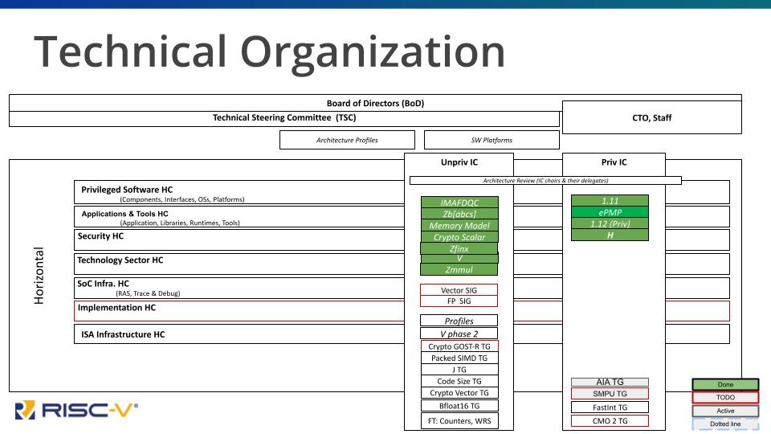
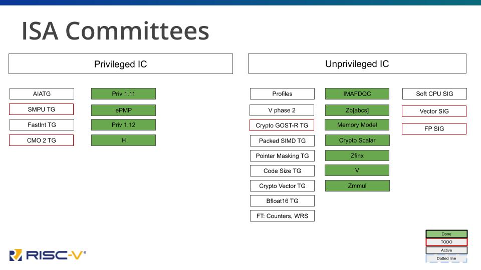

# Technical Working Group Organization
## RISC-V’s Technical Organization
RISC-V’s technical organization is organized in a hierarchy, with a number of leadership roles at each level.

The RISC-V founders continue to be deeply involved in the development and implementation of RISC-V. Krste Asanović, Yunsup Lee, and Andrew Waterman all participate daily as technical task group and committee chairs as well as mentors to other technical leaders. David Patterson and Krste Asanović represent member organizations on the Board of Directors, providing business and industry guidance as well as technical leadership.

## Terminology
These terms describe the various types of groups in the technical organization, along with their chartered responsibilities. These groups are described in detail later in this section.

**Technical Steering Committee (TSC)**
Primary decision-making body within the technical organization.

**Chief Technology Office (CTO)**
Runs TSC voting process, Leadership Strategy Meeting (LSM) and Chairs meetings, strategy, organization, IT, roadmap, resources, escalations.

**ISA Committees (IC)**
Approve and oversee packages for TSC votes for the creation of ISA Extension TGs, as well as filling the chair and vice-chair vacancies for its TGs. Develop strategy for the groups under it and complete coverage of areas of responsibility under it including gaps.

**Horizontal Committees (HC)**
Approve and oversee TGs working on activities other than ISA extensions. Has responsibilities to make sure that all ISA TGs cover the area overseen by the HC before ratification. Responsible for developing a holistic strategy and reaching out to the external ecosystem and community groups.

**Task Groups (TG)**
Must have a charter that defines deliverable work products: extension specifications, standards, requirements, best practices, etc. TGs under the unpriv and priv SC can have ISA extension work products. TGs under HCs should not have ISA extension work products.

**Special Interest Groups (SIG)**
Topic discussion. No work product. Can be created by the TSC, ICs or HCs with TSC approval not required.

**Chair & Vice-Chair**
Leadership positions for a committee, task group, or SIG. These positions are generally elected on an annual basis. Chairs are always from member organizations, while vice-chairs may be either Individual members or representing organizations. Chairs and vice-chairs meet weekly to collaborate and discuss organizational details.

## Technical Leadership & Governance
Technical direction and decision-making happens within the governance committees - the Technical Steering Committee (TSC) as well as a host of committees and special interest groups (SIGs). Direct work on the specifications is driven by individual task groups working on specific specifications, software initiatives, testing or compliance frameworks, and many other ongoing projects. This work is organized and directed by technical leadership, and enabled and tracked by RISC-V’s neutral technical staff.

## Technical Steering Committee
The Technical Steering Committee (TSC) provides leadership to our technical initiatives. They are assisted by the Standing Committees, Technical Task Groups, and Special Interest Groups, all of which report to the TSC.

The TSC delegates responsibilities to organizational components below it in the hierarchy of groups. In addition, it discusses and decides on strategy, escalations, group and chair and preliminary charter approvals, and extension ratification.

The TSC has voting members as well as non-voting attendees who participate in a regular Leadership Strategy Meeting (LSM). Voting members include representatives from premier members as well as HC and IC chairs, although a single member organization may only be represented once in the group. Non-voting members include RISC-V staff, invited guests, and advisors. Next, we will describe each level of the technical organization underneath the authority of the TSC. Note that the details change from time to time, so be sure to check out the RISC-V website for the most up to date information about the technical organization. These images show the organization as of August 2022:

## ISA and Horizontal Committees
Committees are responsible for directing work within the scope of their charter. ISA committees - “priv” and “unpriv”, referring to the Privileged and Unprivileged RISC-V specification volumes - direct the creation of specific extensions. Horizontal committees - including Software, Security, ISA Infrastructure, SOC Infrastructure, Implementation, and others - are responsible for directing specification work in their areas other than ISA extensions. All ISA extensions must be signed off by each of the Horizontal committees prior to ratification.

## Task Groups
This is where the actual work is done on specifications, software, test frameworks, and other concrete deliverables. Task groups are usually started for a specific purpose, which is then written into their charter and approved by the committee responsible for them. Some task groups finish their work relatively quickly (within 3-6 months) while others work for much longer to make sure the final product is worthy of inclusion.

Task group products go through an approval process called ratification that we will cover in Chapter 4.

The chair for each group is responsible for directing the activities, overseeing the creation of the deliverable work product (spec, software, etc.), reporting back to the Committee and the technical organization on status, and attending a weekly chairs meeting. Vice-chairs share the responsibilities and the effort, but chairs hold the final responsibility for the group. Chairs and vice-chairs are elected by the community and serve 1-year terms between election cycles, although there are no term limits and existing chairs may reapply.

## Technical Staff
As we have said, RISC-V International is a member-driven organization, but there are some specific roles that are best filled by a neutral party - someone without a stake in any specific member’s interests. In addition, there are many administrative tasks that have to be done to keep the organization running smoothly. These are the roles filled by RISC-V staff, who are hired into RISC-V through their agreement with the Linux Foundation and who work directly for RISC-V.

**Chief Technical Officer**
The CTO role is vital, as it provides a neutral leadership function that can’t be filled by a member. The CTO takes all members’ needs into account to both instigate and drive organization and initiatives within the technical hierarchy, and to facilitate negotiation at all levels within working groups, committees, and governance groups. The CTO also creates and seeks approval for organizational policies, and reports technical progress up to the Board of Directors and functions as the neutral voice of the technical community in workshops and public events.

**Technical Program Managers**
This is a catch-all term for experienced individuals who perform all of the operational activities within the project, including everything from running meetings to setting up calendar entries and conference calls to organizing technical information and even writing detailed technical policies.

**Other Technical Staff**
While the above roles are the only permanent staff in the technical organization, RISC-V occasionally hires contractors for specific tasks, including test development and documentation.

