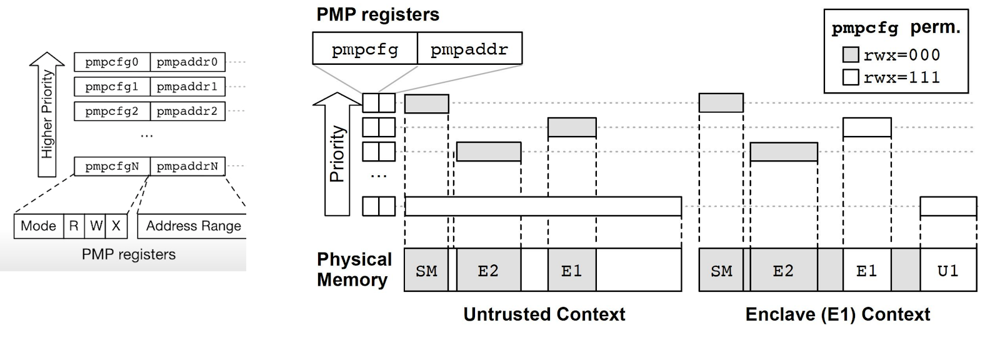

# The Privileged Specification
## Overview
As its name suggests, the privileged specification contains descriptions of the RISC-V ISA which operate in Machine Mode (M-mode) or Supervisor Mode (S-mode). These modes have elevated privileges and are therefore described in a completely separate document from the base ISA and standard extensions. This specification also contains additional functionality required for running rich operating systems like Linux.

The first part of each chapter of the privileged specification details the Control and Status Registers (CSRs) which are only accessible from M-mode and S-mode. We will not cover these details here, but will rather focus on other details specific to these two modes.

## Machine-Level (M-Mode) ISA, Version 1.11
This chapter describes the machine-level features available in machine-mode (M-mode). M-mode is used for low-level access to a hardware platform and is the first mode entered at reset, when the processor finishes initializing and is ready to execute code. M-mode can also be used to implement features that are too difficult or expensive to implement in hardware directly. A good example of this would be a watchdog timer implemented in low level software (firmware) which helps the system recover from faults. We will cover three important features of M-mode described in the specification: non-maskable interrupts, physical memory attributes, and physical memory protection.

## Non-Maskable Interrupts (NMIs)
Non-maskable interrupts (NMIs) are only used for hardware error conditions. When fired, they cause an immediate jump to an NMI handler running in M-mode, regardless of how that hardware thread has its interrupt enable bit set. In other words, that interrupt will be serviced without a way to block the service in configuration. Each NMI will have a “mcause” register associated with it. This allows implementations to decide how they wish to handle these interrupts and allows them to define many possible causes. NMIs do not reset processor state which enables diagnosis, reporting, and possible containment of the hardware error.

## Physical Memory Attributes (PMA)
The physical memory map for a system includes address ranges like: memory regions, memory-mapped control registers, and empty holes in the address space. Some memory regions might not support reads, writes, or execution; some might not support subword or subblock accesses; some might not support atomic operations; and some might not support cache coherence or might have different memory models. In RISC-V systems, these properties and capabilities of each region of the machine’s physical address space are termed physical memory attributes (PMAs).

The PMAs of some memory regions are fixed at chip design time—for example, for an on-chip ROM. Others are fixed at board design time, depending, for example, on which other chips are connected to off-chip buses. Some devices might be configurable at run time to support different uses that imply different PMAs—for example, an on-chip scratchpad RAM might be cached privately by one core in one end-application, or accessed as a shared non-cached memory in another end-application. Most systems will require that at least some PMAs are dynamically checked in hardware later in the execution pipeline after the physical address is known, as some operations will not be supported at all physical memory addresses, and some operations require knowing the current setting of a configurable PMA attribute.

For RISC-V, we separate out specification and checking of PMAs into a separate hardware structure, the “PMA checker”. In many cases, the attributes are known at system design time for each physical address region, and can be hardwired into the PMA checker. Where the attributes are run-time configurable, platform-specific memory-mapped control registers can be provided to specify these attributes at a granularity appropriate to each region on the platform (e.g., for an on-chip static random-access memory (SRAM) that can be flexibly divided between cacheable and uncacheable uses).

The details of PMAs could easily take up an entire chapter of this course. We will not cover memory-ordering PMAs, idempotency PMAs, coherence PMAs, or cacheability PMAs. The details of PMAs are described in detail in section 3.5 of the [Privileged Specification](https://riscv.org/technical/specifications/). Advanced users may want to review this section.

## Physical Memory Protection (PMP)
A common feature of most modern processors is some way of performing secure remote computation or a “trusted execution environment”. Examples of this technology include Intel Software Guard Extensions (SGX), AMD Secure Encrypted Virtualization (SEV), and Arm TrustZone. While the RISC-V ISA does not provide an end-to-end solution for Trusted Execution Environments, the physical memory protection (PMP) capabilities are a solid foundation on which one might construct such a system.

RISC-V PMP limits the physical addresses accessible by software running on a hart (hardware thread). An optional PMP unit provides per-hart machine-mode control registers to allow physical memory access privileges (read, write, execute) to be specified for each physical memory region. The PMP values are checked in parallel with the PMA checks we covered in the last section. The granularity of PMP access control settings are platform-specific and within a platform may vary by physical memory region, but the standard PMP encoding supports regions as small as four bytes. Certain regions’ privileges can be hardwired—for example, some regions might only ever be visible in machine mode but in no lower-privilege layers.

PMP entries are described by an 8-bit configuration register and one 32 (or 64) bit address register. Up to 16 PMP entries are supported. If any PMP entries are implemented, then all PMP CSRs must be implemented, but any PMP CSR fields may be hardwired to zero. PMP CSRs are only accessible to M-mode.

**By Lee, D., Kohlbrenner, D., Shinde, S., Song, D., & Asanovic, K. (2019). Keystone: A Framework for Architecting TEEs. CoRR, vol. abs/1907.10119** http://arxiv.org/abs/1907.10119.

Here we see an example of how one might set up two different contexts, one untrusted and one with access to “Enclave E1”. In this example an application is run in user context U1. That application only has access to its own memory and the memory inside enclave E1. The memory inside enclave E2 and that located in the “security monitor” (SM) are not available to the user application. In this way, data confidentiality is assured simply by allowing the security monitor (running in M-mode) to change the PMP settings allowing or denying access to memory regions based on the PMP configurations.

## Supervisor-Level (S-Mode) ISA, Version 1.11
This chapter describes the RISC-V supervisor-level architecture, which contains a common core that is used with various supervisor-level address translation and protection schemes. Supervisor mode is deliberately restricted in terms of interactions with underlying physical hardware, such as physical memory and device interrupts, to support clean virtualization. In this spirit, certain supervisor-level facilities, including requests for timer and interprocessor interrupts, are provided by implementation-specific mechanisms. In some systems, a supervisor execution environment (SEE) provides these facilities in a manner specified by a supervisor binary interface (SBI). Other systems supply these facilities directly, through some other implementation-defined mechanism.

RISC-V supports Page-Based 32-bit, 39-bit, and 48-bit virtual memory addressing. The supervisor (S-Mode) memory-management fence instruction (SFENCE.VMA) is used to synchronize updates to in-memory memory-management data structures with current execution. Executing this instruction guarantees that any previous stores already visible to the current RISC-V hart (hardware thread) are ordered before all subsequent implicit references from that hart to the memory-management data structures.

Virtual Memory is a concept which takes several months of graduate level education to grasp and is beyond the scope of this course. It is enough for this course that you understand that RISC-V supports Page-Based virtual memory of several widths, and that there is a special S-Mode instruction used for synchronizing updates between hardware threads.

## Non-ISA Specifications
Task Groups can also work on software or standards that are not part of the ISA. For example, the following groups work on projects that do not lead to specifications being written, but rather standards that encourage communities to develop their products around a common framework:
- *Debug Task Group* working on external debugging support and standards.
- *Compliance Task Group* working on RISC-V ISA compliance tests and frameworks.
- *Configuration Structure Task Group* working on how to represent the configuration structure of a given hardware implementation both in a human-readable format, as well as a binary format.
