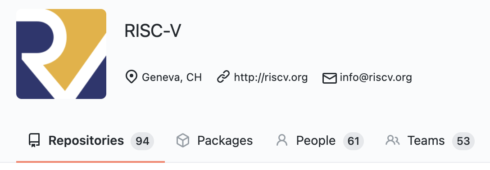
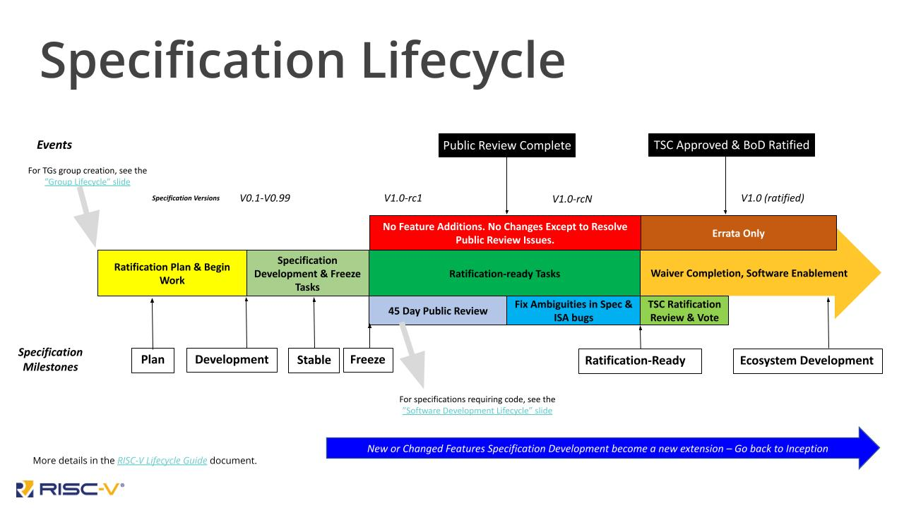

# RISC-V Instruction Set Architecture Primer
## Defining an Instruction Set Architecture (ISA)
An instruction set architecture (ISA) is an abstract model of a computer. It is also referred to as architecture or computer architecture. A realization of an ISA, such as a central processing unit (CPU), is called an implementation. Some ISAs you may have heard of include x86, ARM, MIPS, PowerPC, or SPARC. All of these ISAs require a license to implement them. On the other hand, the RISC-V ISA is provided under open source licenses that do not require fees to use.

## How the RISC-V ISA Is Different
The most notable difference between RISC-V and other ISAs is that RISC-V is developed by a member organization that is completely free to join and licenses its ISA with permissive open source licenses. This means that anyone can contribute to the specifications, and no one company or group of companies can drive the direction of the standards.

RISC-V International is governed by its Board of Directors. The Board is composed of members elected to represent all classes of membership to ensure we offer a strategic voice at all levels. In addition, the Technical Steering Committee (TSC) provides leadership to our technical initiatives in setting long term strategy, forming tactical committees and work groups, and approving technical deliverables for ratification or release.

## Collaborative Development Model
A RISC-V Specification starts its life as a Task Group approved by the Technical Steering Committee (TSC). Once a Task Group has an approved charter, they begin work publicly on GitHub by writing their documents in AsciiDoc format. These repositories on GitHub can only receive pull requests from RISC-V International members, however the work is done publicly and transparently. For groups who choose to take minutes, those minutes from the Task Group meetings are published publicly as well. The public is free to submit issues to the GitHub repository in order to give early feedback on any specification. Non-ISA specifications and standards (e.g. processor trace, architectural tests, software overlay) are developed in a similar fashion.

RISC-V Specifications live on GitHub and are housed alongside dozens of software projects. See a [list of ratified specifications](https://riscv.org/technical/specifications/) and the links to their GitHub repositories.

## Creating and Curating Open Specifications
The process of writing the specifications is usually led by a Hardware Architect at one of the RISC-V International member organizations. They may not write the actual text, but they act as the chair to the Task Group overseeing the specification’s development. It can take anywhere from several months to more than a year for the group to complete a specification. We will talk about the lifecycle of an extension later in this chapter.

What makes this development process open hinges on three key facts:
1. The Task Group mailing list is publicly visible.
2. The specification document is publicly visible and comments can be left.
3. There is a public mailing list where anyone can send email. (isa-dev@groups.riscv.org)

Using this methodology, even non-members can participate in the development of any specification or standard by asking questions, making suggestions, or simply following along. Furthermore, during the ratification process, there is a 45 day window where all specification work must be frozen and the specification published publicly for review. Anyone is welcome to comment at this time and all issues will be brought to resolution before the vote for ratification happens.

While becoming a member of RISC-V International is the easiest way to contribute to open specifications, it is not the only way. Anyway can contribute by interacting with the Task Groups in public forums like the [mailing list](https://riscv.org/mailing-lists/) and GitHub.

## RISC-V Extensions Lifecycle
Each RISC-V extension goes through several stages on its way to ratification. In this section we will briefly review each stage known as a “milestone”.

1. Plan \
   The task group develops a final charter and sets some timeline estimates.
2. Development \
   The groups releases several versions considered unstable.
3. Freeze \
   The group produces a complete final draft of the specification with no major unknowns and no expected changes (only to fix issues but no new features).
4. Ratification Ready \
   The draft specification is sent out for public review, any public comments or questions are addressed, and the Technical Steering Committee is made aware that a vote is required.
5. Ecosystem Development \
   The extension is ratified and supported as part of the RISC-V ISA. Many tasks remain for the community to work on. As an example, the Vector specification was ratified, however adding auto-vectorization to compilers is part of that specification’s Ecosystem Development task list.

Once an extension has been ratified it is added to either the Unprivileged or Privileged Specification. Occasionally a specification is created as part of a separate document, with the debug specification being the most common example. However, this is a rare case and usually indicates that the extension is not part of the ISA, but rather a “standard” or “non-ISA specification”. We will now review the Unprivileged and Privileged Specification in greater detail.